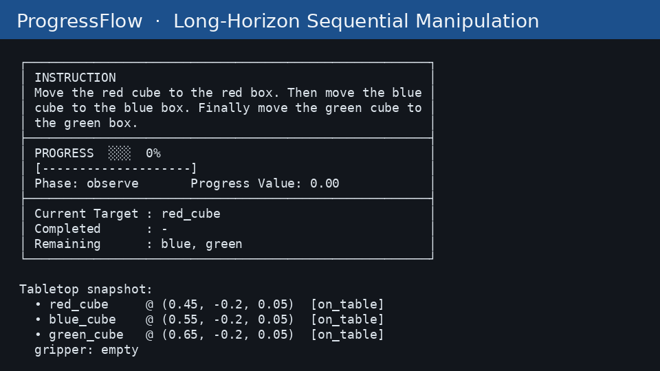

# ProgressFlow

**Progress-aware long-horizon manipulation demo**, inspired by [PALM](https://plan-lab.github.io/projects/palm/).

Franka Panda · Table · 3 Cubes · 3 Target Zones · Language Instruction · Progress State · Evaluation

> Core idea: long-horizon sequential manipulation is not a single `Observe → Done` step.
> It is a chain of subtasks with an explicit **progress representation**.

<p align="center">
  
</p>

<p align="center"><em>Sequential pick-and-place with live progress: 0% → 33% → 66% → 100%</em></p>

---

## Motivation

Language-conditioned robot policies often fail on **long-horizon** instructions because they lack an explicit notion of *where they are* in a multi-step plan.

[PALM](https://plan-lab.github.io/projects/palm/) emphasizes **progress-aware** reasoning over subtasks. ProgressFlow turns that idea into a minimal, reproducible teaching demo:

| Without progress | With Progress Manager |
| --- | --- |
| Repeat grasp / forget next object | Follow `1/3 → 2/3 → 3/3` |
| Opaque success/fail | Interpretable subtask states |
| Hard to debug | HUD shows current target & phase |

I use a **rule-based Progress Manager** (no neural net) so the demo stays clear for teaching / course projects. Learned progress prediction is left as Future Work.

---

## Demo Task

**Robot sees**

```
Table:   Cube A (red) · Cube B (blue) · Cube C (green)
Targets: Blue Area · Red Area · Green Area
```

**Instruction**

```
Move the red cube to the red box.
Then move the blue cube to the blue box.
Finally move the green cube to the green box.
```

This is a classic **long-horizon / sequential manipulation** problem: multiple subtasks, each with `Observe → Pick → Transport → Place → Update Progress → Next Task`.

---

## Pipeline

```
Language Instruction
        ↓
   Task Parser
        ↓
 Progress Manager     ←── progress value, current/completed/remaining
        ↓
   Robot Policy
        ↓
   Simulation (Isaac Lab / TableTopSim)
        ↓
 Visualization (HUD)
        ↓
   Evaluation
```

Stack for the full Isaac Lab deployment:

```
Isaac Lab → Franka Panda → Table → 3 Cubes → 3 Target Zones
        → Language Instruction → Robot Policy → Progress State
        → Visualization → Evaluation
```

---

## Progress Representation (core)

Statuses per subtask:

```
pending → active → grasped → completed
```

Example:

```
Task 1  red cube     status = pending
grab                 status = grasped
place                status = completed   → Progress 1/3 = 0.33
Task 2  blue cube    ...                  → 0.66
Task 3  green cube   ...                  → 1.00
```

`ProgressManager` exposes:

- `current_task`
- `completed_tasks`
- `remaining_tasks`
- `progress_value ∈ [0, 1]`
- `phase ∈ {observe, pick, transport, place, update, done}`

---

## Visualization (HUD)

```
┌──────────────────────────────────────────────────────┐
│ INSTRUCTION                                          │
│ Move the red cube to the red box. Then move the ...  │
├──────────────────────────────────────────────────────┤
│ PROGRESS  █░░  33%                                   │
│ Phase: transport     Progress Value: 0.33            │
├──────────────────────────────────────────────────────┤
│ Current Target : blue_cube                           │
│ Completed      : red                                 │
│ Remaining      : green                               │
└──────────────────────────────────────────────────────┘
```

This is the demo analogue of PALM's **progress value**.

---

## Repository Layout

```
ProgressFlow/
├── README.md
├── TECHNICAL_SUMMARY.md
├── main.py
├── configs/
│   ├── default.yaml
│   └── isaac_lab.yaml
├── assets/scene_manifest.yaml
├── scripts/
│   ├── make_demo_gif.py
│   └── run_isaac_lab_scene.py      # Isaac Lab launcher
└── progressflow/
    ├── progress_manager.py
    ├── task_manager.py
    ├── evaluation.py
    ├── policy/
    ├── viz/
    └── sim/
        ├── tabletop.py             # CPU demo backend
        ├── isaac_lab_env.py        # adapter
        └── isaac_lab/
            ├── scene_cfg.py        # Franka + table + 3 cubes + 3 zones
            ├── env_cfg.py          # ManagerBasedRLEnvCfg
            ├── mdp.py              # obs / zone success
            └── controller.py       # Action → abs IK pick-place
```

---

## Quickstart (no Isaac Lab required)

```bash
cd ProgressFlow
python main.py demo --sleep 0.15
python main.py eval --episodes 30
python main.py both --sleep 0.0
```

Generate a 1-minute-style visual demo GIF:

```bash
python scripts/make_demo_gif.py
```

### Isaac Lab scene assembly

Requires [Isaac Lab](https://isaac-sim.github.io/IsaacLab/). Scene matches the demo stack:

`Franka Panda → Table → red/blue/green cubes → red/blue/green target pads`

```bash
# From your Isaac Lab install directory:
./isaaclab.sh -p /path/to/ProgressFlow/scripts/run_isaac_lab_scene.py --mode scene
./isaaclab.sh -p /path/to/ProgressFlow/scripts/run_isaac_lab_scene.py --mode demo
./isaaclab.sh -p /path/to/ProgressFlow/scripts/run_isaac_lab_scene.py --mode baseline
```

| File | Role |
| --- | --- |
| `progressflow/sim/isaac_lab/scene_cfg.py` | `ProgressFlowSceneCfg` — assets & layout |
| `progressflow/sim/isaac_lab/env_cfg.py` | `ProgressFlowEnvCfg` — abs IK / joint control |
| `progressflow/sim/isaac_lab/controller.py` | Approach→Grasp→Transport→Place primitives |
| `progressflow/sim/isaac_lab_env.py` | Bridges Progress Manager ↔ Isaac Lab |
| `configs/isaac_lab.yaml` | Deploy knobs |
| `assets/scene_manifest.yaml` | USD / pose checklist |

Control defaults to **absolute differential IK** (`ik_abs`) with `FRANKA_PANDA_HIGH_PD_CFG`. Observations from Isaac Lab are converted to the same dict contract as `TableTopSim`, so `ProgressManager` / policies stay unchanged.

---

## Evaluation

We do not only ship a video — we compare:

- **Baseline**: no progress memory (myopic heuristics → wrong / repeated picks)
- **Progress-aware**: consults Progress Manager every step

Run `python main.py eval --episodes 30` to refresh `results/evaluation.md`. Current numbers:

| Method | Success Rate | Avg Completion | Wrong Pick | Repeated Pick | Avg Steps |
| --- | --- | --- | --- | --- | --- |
| baseline | 0.03 | 0.30 | 19.23 | 37.33 | 58.9 |
| progress_aware | **1.00** | **1.00** | **0.00** | **0.00** | **15.0** |

Metrics:

- **Task Success Rate** — full 3/3 completion
- **Average Completion** — mean fraction of subtasks finished
- **Wrong Pick** — grasped object ≠ current instructed object
- **Repeated Pick** — re-grasp after successful place
- **Completion Time** — episode steps

Results are written to `results/evaluation.md`, `evaluation.json`, `evaluation.csv`.

---

## Video Storyboard (~1 min)

1. Show instruction (Red → Blue → Green)
2. Grasp **red** → Progress **33%**
3. Grasp **blue** → Progress **66%**
4. Grasp **green** → Progress **100%**
5. Flash **Success** / metrics overlay

---

## Future Work

- Replace rule-based progress with **learned progress prediction** (PALM-style head)
- Close the loop with a vision-language policy on Isaac Lab cameras
- Scale to longer horizons (drawer + rearrange + insert)
- Domain randomization & multi-env throughput in Isaac Lab
